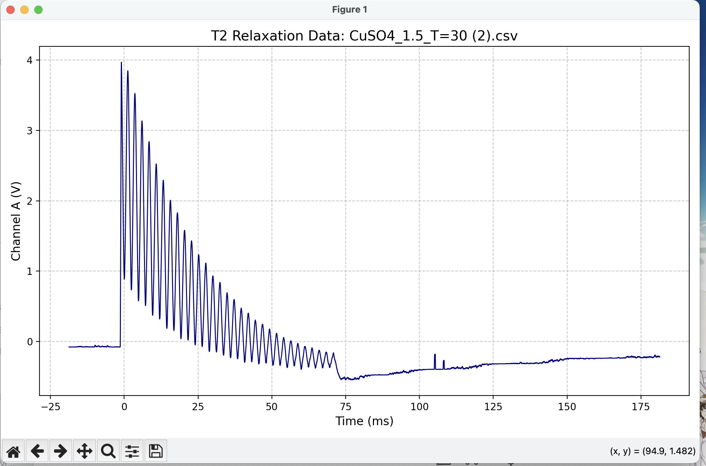

- METHODS:
  - For T1, the measured M_0 is only used as initial guess, and the measured uncertainty in M_0 is not used.

- PROBLEMS:
  - (small problem) Gly_100_T=35 is cleaned to 0 50,a few points lost/ but figures are saved, so use the existing value.

- TODO:
  - CuSO4 T1_concentration some data missing.
  - Glycerol T1_concentration =100 missing.
  - Glycerol T2_temperature T=40 off trend 
  - T2 at T= 30 strange, drop at the end. propbably because not stable yet. redo for both

- what is left:
  - temperature:  
    - T2 at T=0 for both CUSO4_1.5 and gly_100
    - T2 at different temperatrue for CuSO4_50
    - T2 at T=30 for both CUSO4_1.5 and gly_100 
  - concentration
    - T1 CuSO4_conc=50,75_T=24 redo
    - T2 CuSO4 need manually determing peaks for some data
  
 
