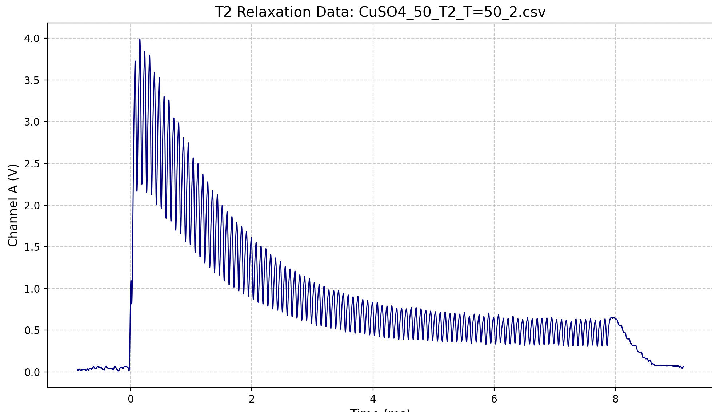
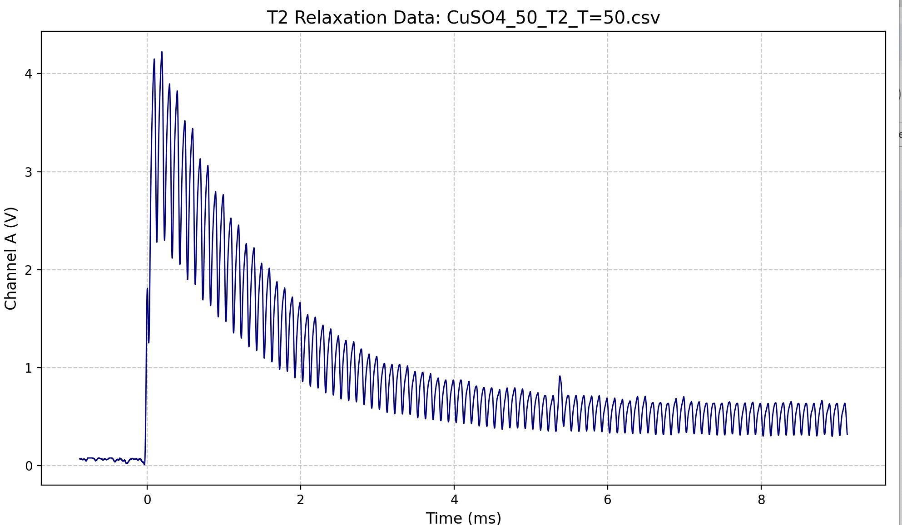

# Day 8

- what is left:
  - temperature:  

  - concentration
    - T1 CuSO4_conc=50,75_T=24 redo
  
 
11:32
- doing T2 CuSO4 concentration redo

13:38
- DONE:
  - T2 CuSO4 concentration trend
  - T2 at T=0 for both CUSO4_1.5 and gly_100
  - T2 at different temperatrue for CuSO4_50
  - T2 at T=30 for both CUSO4_1.5 and gly_100 
- 
- 

POSSIBLEERROR

- heating bath water level too low, T not same as reading from thermometer or machine reading